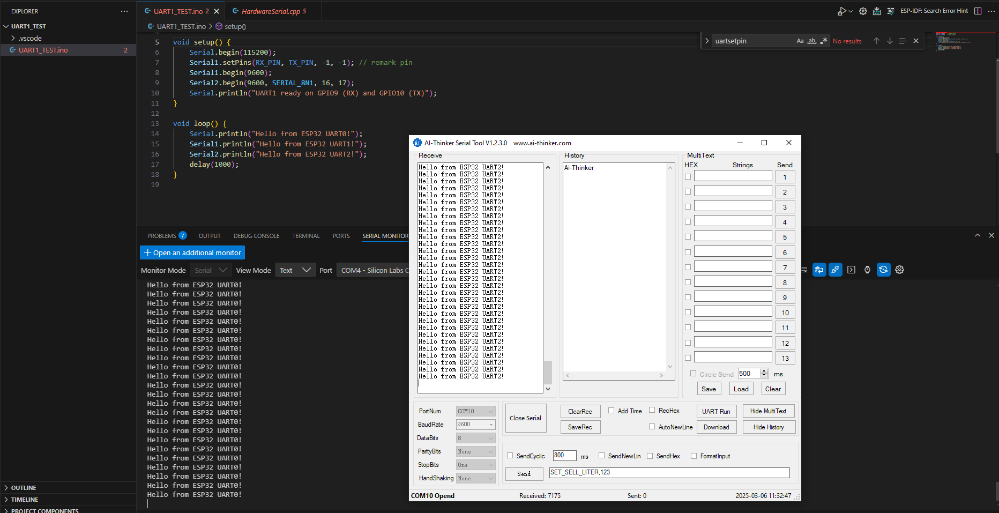
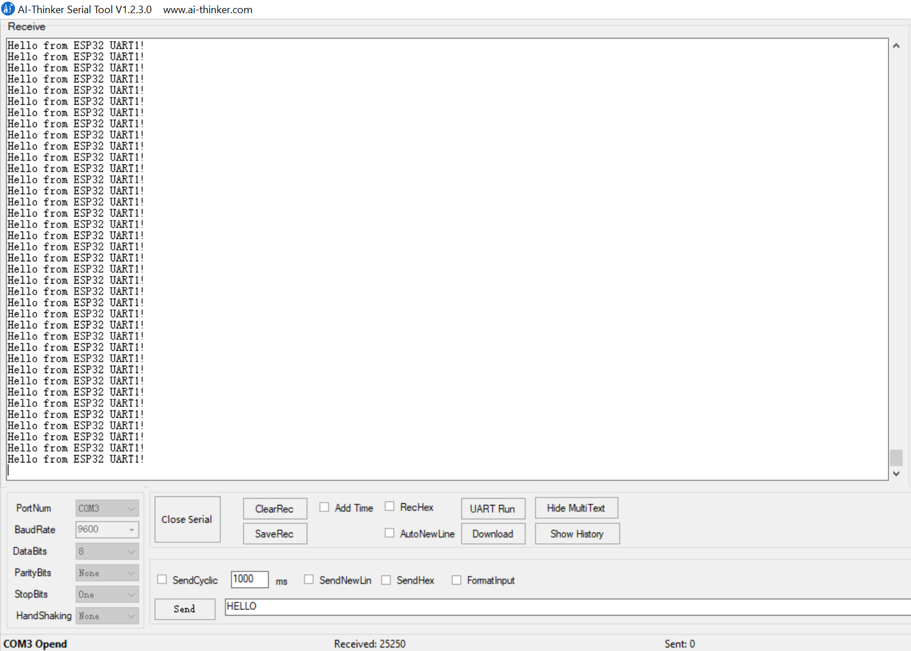

## Setup and Configuration

- The project uses an ESP32 board. Check the [arduino.json](.vscode/arduino.json) file for board settings and COM port configuration.
- In the sketch ([UART1_TEST.ino](UART1_TEST.ino)), the following pins are defined:
  - `TX_PIN`: assigned to a specific GPIO for transmitting data
  - `RX_PIN`: assigned to a specific GPIO for receiving data
- Serial ports are initialized in the `setup()` function:
  - **Serial0** is used for debugging.
  - **Serial1** and **Serial2** are configured with custom pins.

## Hardware Diagram

Below is a diagram depicting the ESP32 UART configuration and wiring setup:

## Building and Uploading

1. Open the project in Visual Studio Code.
2. Ensure that the Arduino extension is installed.
3. Select the correct COM port and board from the Arduino configuration.
4. Use the VS Code command palette or built-in Arduino commands to compile and upload the sketch.

## How It Works

- The sketch writes messages over each UART:
  - "Hello from ESP32 UART0!" on **Serial0**
  - "Hello from ESP32 UART1!" on **Serial1**
  - "Hello from ESP32 UART2!" on **Serial2**
  
- The onboard [HardwareSerial](https://github.com/espressif/arduino-esp32/blob/master/cores/esp32/HardwareSerial.cpp) class manages the low-level UART operations.

Adjust configurations and wiring as needed for your specific hardware.